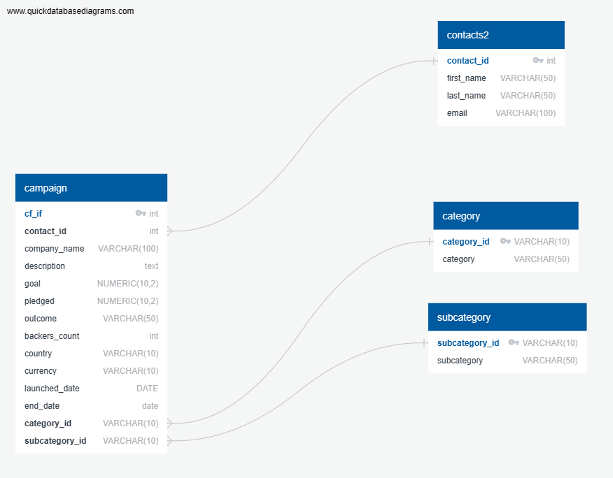

# Crowdfunding_ETL
ETL mini Project 2

# Extract, Transform, Load (ETL):
An ETL miniproject where I built an ETL skills learned on a large dataset. Then using Python, the data was extracted, transformed, and SQL was used to load and query the data. 

## Overview
The Crowdfunding dataset contains information on campaign contributors who made pledges to live projects. Perform the ETL (extract, transform and load) process on the dataset.

## Technologies Used:

* PgAdmin 4
* Visual Studio Code
* Jupyter Notebook
* QuickDBD

# Extract data from the crowdfunding.xlsx file

## Create the Category and SubCategory

- Cleaned the DataFrame by splitting a column into a Category and SubCategory column.

- Used list comprehensions to create category_id/subcategory_id columns to identify the categories/subcategories. 

## Campaign DataFrame

- The "blurb" column, renamed to "description"
- The "goal" column, converted to the float data type
- The "pledged" column, converted to the float data type
- The "launched_at" column, renamed to "launch_date" and with the UTC times converted to the datetime format
- The "deadline" column, renamed to "end_date" and with the UTC times converted to the datetime format
- A "category_id" column that contains the unique identification numbers matching those in the "category_id" column of the category DataFrame
- A "subcategory_id" column that contains the unique identification numbers matching those in the "subcategory_id" column of the subcategory DataFrame

## ERD

